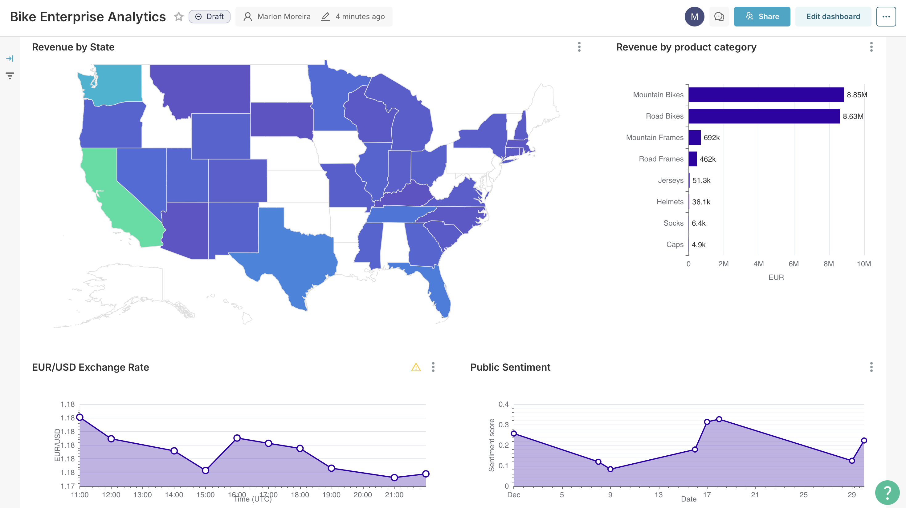
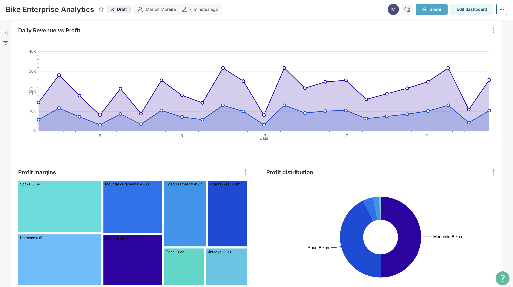
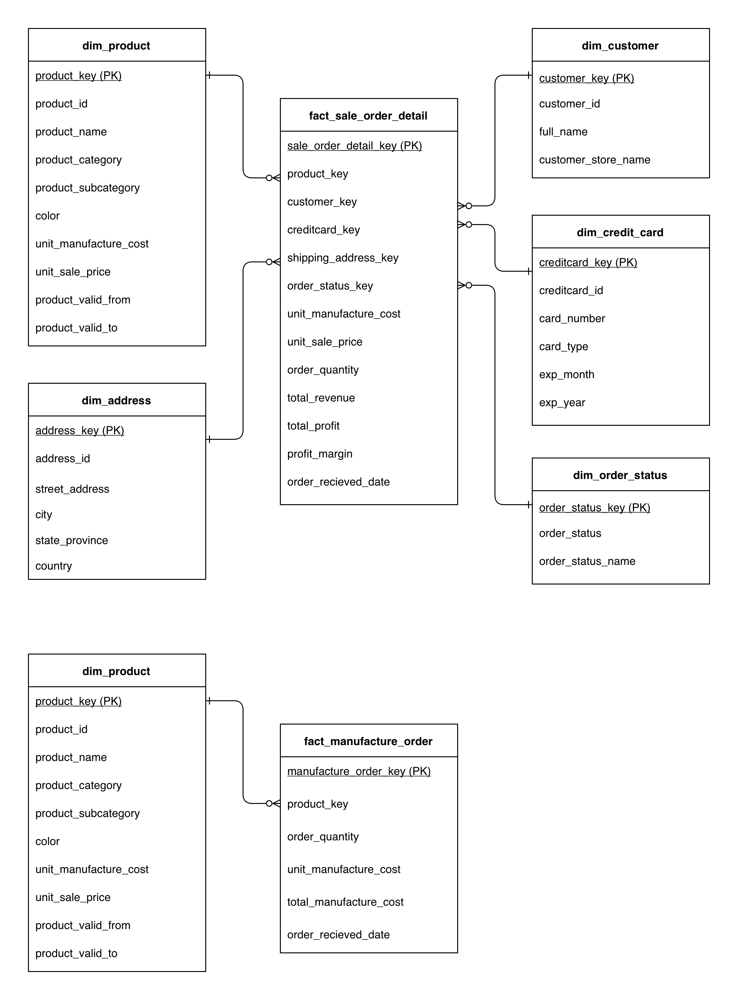
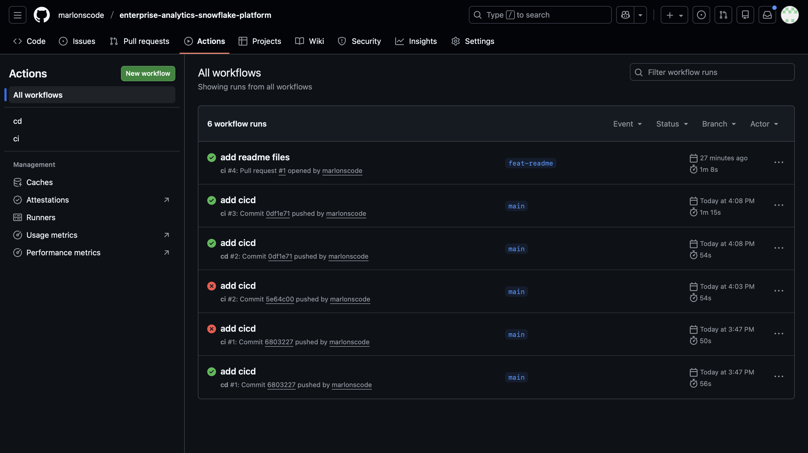

# Enterprise Analytics Snowflake Platform ❄️🔮

I wanted to model a real-world enterprise analytics platform, so I built one using Snowflake! The platform represents the operations of a fictional bicycle manufacturing enterprise. Various types of data are ingested into the platform:

- Daily public sentiment data about the company, based on recent news headlines
- Hourly foreign exchange data for selected markets
- Daily business operations data
 

## Goal

The goal of this platform is to answer the following business questions:

- What is the revenue/profit over the last month?
- What is the current exhange rate of our largest market (USA)?
- How do people feel about our company (public sentiment)?
- Which products have the best profit margin?
- What types of products do we sell the most?
- What US states do we get the most revenue from?
 

## End Result

The end result is the following dashboard, which answers these questions

Figure: Dashboard page 1
 
 

Figure: Dashboard page 2
 
 

## Solution Architecture

Figure: Simplified architecture
 
 

Figure: Detailed architecture
 
 

## Features

| **Feature** | **Details** |
|-------------|-------------|
| **ELT & Streaming Pipelines** | • Airbyte pipelines extract and load data from API, S3, and RDBMS • Extraction patterns: incremental, full • Load patterns: upsert, append, overwrite • Pipelines orchestrated with Dagster on a schedule |
| **Cloud & Infrastructure** | • Deployed on AWS using Terraform • Services: Lambda, ECS, ECR, EC2, S3, RDS, SQS, SNS, EventBridge, IAM |
| **Data Modeling & Warehousing** | • Kimball & OBT modeling with medallion architecture (raw → staging → marts) • 2 fact tables, 6 dimension tables, 2 OBT tables • SCD2 table for historical tracking • Clustering applied on OBT tables to improve dashboard performance |
| **Analytics Engineering** | • SQL transformations using dbt • SQL techniques: joins, aggregations, window functions, calculations, CTEs • dbt features: macros, generic/custom tests, snapshots, profiles/targets, packages, incremental models |
| **Python & Orchestration** | • 3 Lambda functions written in Python • Unit testing with pytest • Orchestration handled via Dagster • Dagster code written in Python |
| **Pipeline Observability & Reliability** | • Dagster retry policy for failed pipelines • Dagster Slack alerting to notify pipeline success/failure • dbt Source freshness warnings to notify of stale data |
| **FinOps** | • S3 Lifecycle policies to archive/delete old data • Serverless services used wherever possible/appropriate (e.g., Dagster Cloud) |
| **CI/CD & Git** | • GitHub Actions for CI/CD • Pipelines include linting, testing, Docker container builds, and deployments • Branch protection rules enforce PR-based workflow |
| **Dashboarding & Semantic Layer** | • Preset dashboard to answer business questions • Semantic layer techniques: calculated metrics and columns |
 

<!--
- **ELT & Streaming Pipelines**
  - Airbyte pipelines extract and load data from 3 different: API, S3, and RDBMS
  - Extraction patterns: incremental, full
  - Load patterns: upsert, append, overwrite
  - Pipelines orchestrated with Dagster on a schedule

- **Cloud & Infrastructure**
  - Deployed on AWS using Terraform
  - Services: Lambda, ECS, ECR, EC2, S3, RDS, SQS, SNS, EventBridge, IAM

- **Data Modeling & Warehousing**
  - Kimball & OBT modeling with medallion architecture (raw → staging → marts)
  - 2 fact tables, 6 dimension tables, 2 OBT tables
  - SCD2 table
  - Clustering applied on OBT tables to improve dashboard performance

- **Analytics Engineering**
  - SQL transformations using dbt
  - SQL techniques: joins, aggregations, window functions, calculations, CTEs
  - dbt features: macros, generic/custom tests, snapshots, profiles/targets, packages, incremental models

- **Python & Orchestration**
  - 3 Lambda functions written in Python
  - Unit testing with pytest
  - Orchestration handled via Dagster
  - Dagster code written in Python

- **Pipeline Observability & Reliability**
  - Dagster retry policy for failed pipelines
  - Dagster Slack alerting to notify pipeline success/failure
  - dbt Source freshness warnings to notify of stale data

- **FinOps**
  - S3 Lifecycle policies to archive/delete old data
  - Servereless services used wherever possible/appropriate (e.g. Dagster Cloud)

- **CI/CD & Git**
  - GitHub Actions for CI/CD
  - CI/CD pipelines include linting, testing, Docker container builds, and deployments
  - Branch protection rules to enforce PR-based workflow

- **Dashboarding & Semantic Layer**
  - Preset dashboard to answer business questions
-->

## Screenshots

Figure: dbt DAG
 
 

Figure: Kimball models created using dbt
 
 

Figure: Airbye connections
 
 

Figure: Snowflake compute cluster monitoring
 
 

Figure: Dagster pipeline successful run
 
 

Figure: Github Actions workflow runs
 
 

Figure: CI/CD flow diagram
 
 

